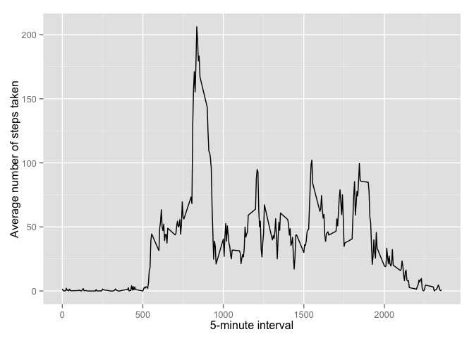
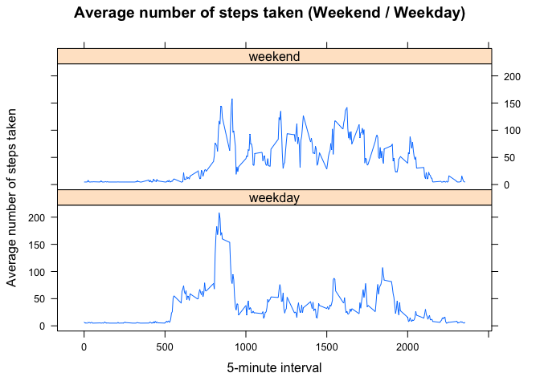

# Reproducible Research: Peer Assessment 1


## Required Packages:

```r
library(ggplot2)
library(Hmisc)
```


## Loading and preprocessing the data

#### 1. Load the data

```r
unzip(zipfile="activity.zip")
data <- read.csv("activity.csv")
```

#### 2. Process/transform the data (if necessary) into a format suitable for your analysis

```r
# Not Applicable
```


## What is mean total number of steps taken per day?

#### 1. Calculate the total number of steps taken per day

```r
totalStepsByDay <- aggregate(steps ~ date, data, FUN=sum, na.rm=TRUE)
```

#### 2. Make a histogram of the total number of steps taken each day

```r
hist(totalStepsByDay$steps,
     main="", xlab="Total number of steps taken each day")
```

 

#### 3. Calculate and report the mean and median total number of steps taken per day

```r
mean(totalStepsByDay$steps, na.rm=TRUE)
```

```
## [1] 10766.19
```

```r
median(totalStepsByDay$steps, na.rm=TRUE)
```

```
## [1] 10765
```


## What is the average daily activity pattern?

```r
averages <- aggregate(x=list(steps=data$steps),
                      by=list(interval=data$interval),
                      FUN=mean, na.rm=TRUE)
```

#### 1. Make a time series plot of the 5-minute interval (x-axis) and the average number of steps taken, averaged across all days (y-axis)

```r
ggplot(averages, aes(x=interval, y=steps)) +
    geom_line() +
    xlab("5-minute interval") +
    ylab("Average number of steps taken")
```

 

####2. Which 5-minute interval, on average across all the days in the dataset, contains the maximum number of steps?

```r
averages[which.max(averages$steps), ]
```

```
##     interval    steps
## 104      835 206.1698
```


## Imputing missing values
There are a number of days/intervals where there are missing values (coded as NA). The presence of missing days may introduce bias into some calculations or summaries of the data.

#### 1. Calculate and report the total number of missing values in the dataset

```r
length(which(is.na(data$steps)))
```

```
## [1] 2304
```

#### 2. Devise a strategy for filling in all of the missing values in the dataset
All of the missing values are filled in with the mean value.

#### 3. Create a new dataset that is equal to the original dataset but with the missing data filled in

```r
dataImputed <- data
dataImputed$steps <- impute(dataImputed$steps, fun=mean)
```

#### 4. Make a histogram of the total number of steps taken each day and Calculate and report the mean and median total number of steps taken per day. Do these values differ from the estimates from the first part of the assignment? What is the impact of imputing missing data on the estimates of the total daily number of steps?

```r
totalStepsByDayImputed <- aggregate(steps ~ date, dataImputed, FUN=sum, na.rm=TRUE)
hist(totalStepsByDayImputed$steps,
     main="", xlab="Total number of steps taken each day")
```

 

```r
mean(totalStepsByDayImputed$steps, na.rm=TRUE)
```

```
## [1] 10766.19
```

```r
median(totalStepsByDayImputed$steps, na.rm=TRUE)
```

```
## [1] 10766.19
```

Conclusion: Mean and median largely remains the same. However, the frequency of the histogram has increased as expected.


## Are there differences in activity patterns between weekdays and weekends?

#### 1. Create a new factor variable in the dataset with two levels – “weekday” and “weekend” indicating whether a given date is a weekday or weekend day.

```r
dataImputed$dayType <- ifelse(
    as.POSIXlt(dataImputed$date)$wday %in% c(0,6), "weekend", "weekday")
```

#### 2. Make a panel plot containing a time series plot of the 5-minute interval (x-axis) and the average number of steps taken, averaged across all weekday days or weekend days (y-axis)

```r
averagesImputed <- aggregate(steps ~ interval + dayType, data=dataImputed, mean)
ggplot(dataImputed, aes(x=interval, y=steps)) + 
    geom_line() + 
    facet_grid(dayType ~ .) +
    xlab("5-minute interval") + 
    ylab("Average number of steps taken")
```

 
